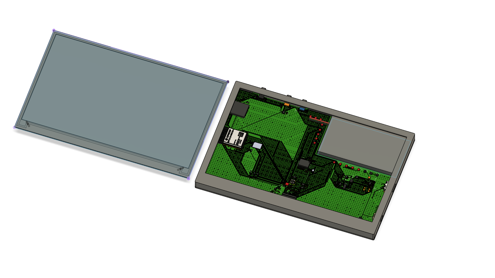
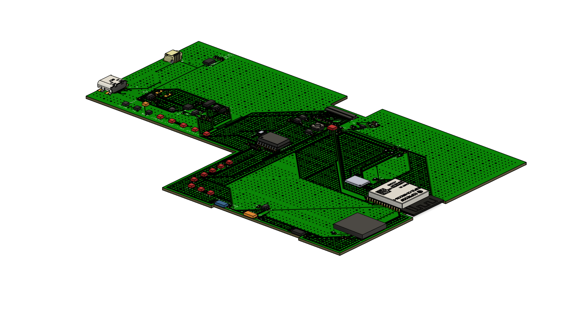

# OpenBook 

  
  
  
  
  

## Implementation Steps

### Schematic Design
I used all the required modules (ESP32-C6, BME688, RTC, Display, etc.) based on the reference schematic. I maintained consistent net naming and used components from the provided library.

### Component Placement
I followed the recommended placement, especially for the ESP32 module (antenna area), buttons, USB port, and display header. All components were placed on the TOP layer, as required.

### Manual Routing
Power traces (3V3, VBAT, VBUS, VUSB, VCC, EPD_3V3, EPD_3V3_C) were routed using a width of 0.3 mm, and signal traces were routed with 0.15 mm width.

### Ground Planes & Via Stitching
I created ground planes on both Top and Bottom layers, connected through via stitching. The area under the ESP32 antenna was excluded (no copper or vias) to ensure proper wireless performance.

### Silkscreen & Test Pads
All components were labeled using only their reference designators (R1, C1, etc.) without values. Test pads were clearly labeled in silkscreen (TX, RX, MISO, VBAT, GND, etc.).

### 3D Model & Enclosure
The final 3D model includes the PCB, display, battery (modeled based on datasheet dimensions), and the official provided enclosure. I verified the alignment of the USB port, buttons, and display header with the housing.

## Component List

- **ESP32-C6-WROOM-1-N8**: Main microcontroller. Supports Wi-Fi 6 (2.4GHz), Bluetooth 5, Thread, and Zigbee. Used for control logic and communication. 
    - **Price**: 14.70 RON
    - **Quantity**: 1
    - **Link**: https://ro.mouser.com/datasheet/2/891/Espressif_ESP32_C6_WROOM_1__Datasheet_V0_1_PRELIMI-3239987.pdf
    - **Datasheet**: https://ro.mouser.com/ProductDetail/Espressif-Systems/ESP32-C6-WROOM-1-N8?qs=8Wlm6%252BaMh8ST02Gmwp74cw%3D%3D

- **W25Q512JVEIQ**: 64MB NOR flash memory. Stores firmware, assets, or user data. Communicates via SPI.
    - **Price**: 28.91 RON
    - **Quantity**: 1
    - **Link**: https://ro.mouser.com/ProductDetail/Winbond/W25Q512JVEIQ?qs=l7cgNqFNU1jw6svr3at6tA%3D%3D
    - **Datasheet**: https://ro.mouser.com/datasheet/2/949/Winbond_W25Q512JV_Datasheet-3240039.pdf

- **MAX17048G+T10**: Fuel gauge IC. Provides battery charge level monitoring via I2C.
    - **Price**: 21.19 RON
    - **Quantity**: 1
    - **Link**: https://ro.mouser.com/ProductDetail/Analog-Devices-Maxim-Integrated/MAX17048G%2bT10?qs=D7PJwyCwLAoGnnn8jEPRBQ%3D%3D
    - **Datasheet**: https://ro.mouser.com/datasheet/2/609/MAX17048_MAX17049-3469099.pdf

- **MCP73831**: Li-Ion/Li-Poly battery charging IC. Controls charging current and status indication.
    - **Price**: 3.72 RON
    - **Quantity**: 1
    - **Link**: https://ro.mouser.com/ProductDetail/Microchip-Technology/MCP73831-2ACI-MC?qs=hH%252BOa0VZEiBneYTVdpuVdg%3D%3D
    - **Datasheet**: https://ro.mouser.com/datasheet/2/268/MCP73831_Family_Data_Sheet_DS20001984H-3441711.pdf

- **XC6220A331MR-G**: Low-dropout (LDO) voltage regulator. Converts USB input (5V) to stable 3.3V for the system.
    - **Price**: 2.50 RON
    - **Quantity**: 1
    - **Link**: https://ro.mouser.com/ProductDetail/Torex-Semiconductor/XC6220A331MR-G?qs=AsjdqWjXhJ8ZSWznL1J0gg%3D%3D
    - **Datasheet**: https://ro.mouser.com/datasheet/2/760/xc6220-3371556.pdf

- **DS3231SN#**: High-accuracy real-time clock (RTC) with battery backup. Communicates over I2C.
    - **Price**: 7.23 RON
    - **Quantity**: 1
    - **Link**: https://ro.mouser.com/ProductDetail/Maxim-Integrated/DS3231SN%23?qs=0x2j%252B5q%252B3v4%252B7g%252B6J9wXQ%3D%3D
    - **Datasheet**: https://ro.mouser.com/datasheet/2/609/DS3231-DS3231M-DS3231S

- **BME688 (ESP32_WROVER_BME688)**: Environmental sensor. Measures temperature, humidity, pressure, and gas (VOC). Uses I2C.
    - **Price**: 48.90 RON
    - **Quantity**: 1
    - **Link**: https://ro.mouser.com/ProductDetail/Bosch-Sensortec/BME688?qs=IS%252B4QmGtzzqQoVDscqwx3A%3D%3D
    - **Datasheet**: https://ro.mouser.com/datasheet/2/783/bst_bme688_fl000-2307034.pdf

- **CPH3225A**: Supercapacitor used for RTC backup power.
    - **Price**: 11.04 RON
    - **Quantity**: 1
    - **Link**: https://ro.mouser.com/ProductDetail/Seiko-Semiconductors/CPH3225A?qs=3etwrb1wR%252BhUOph6lAO7eg%3D%3D
    - **Datasheet**: https://ro.mouser.com/datasheet/2/360/Seiko_Instruments_MicroBattery_E_20230330_2024Jan_-3561061.pdf

- **744043680IND_4828-WE-TPC_WRE**: Inductor (68µH). Used for filtering or part of the power supply circuit.
    - **Price**: 6.44 RON
    - **Quantity**: 1
    - **Link**: https://ro.mouser.com/ProductDetail/Wurth-Elektronik/744043680?qs=PGXP4M47uW6VkZq%252BkzjrHA%3D%3D
    - **Datasheet**: https://www.we-online.com/components/products/datasheet/744043680.pdf

- **MBR0530**: Schottky diodes. Used for reverse voltage protection and power path steering.
    - **Price**: 0.90 RON
    - **Quantity**: 3
    - **Link**: https://ro.mouser.com/ProductDetail/onsemi/MBR0530T3G?qs=3JMERSakebpEmdUS6GetdQ%3D%3D
    - **Datasheet**: https://www.onsemi.com/PowerSolutions/product.do?id=MBR0530T3G

- **BD5229G-TR**: Voltage detector. Used for power-on reset or system supervisory functions.
    - **Price**: 3.72 RON
    - **Quantity**: 1
    - **Link**: https://ro.mouser.com/ProductDetail/ROHM-Semiconductor/BD5229G-TR?qs=4kLU8WoGk0vvnhrrYwdszw%3D%3D
    - **Datasheet**: https://fscdn.rohm.com/en/products/databook/datasheet/ic/power/voltage_detector/bd52xxg-e.pdf

- **SI1308EDL-T1-GE3**: N-channel MOSFET. Used for switching or power control.
    - **Price**: 2.07 RON
    - **Quantity**: 1
    - **Link**: https://ro.mouser.com/ProductDetail/Vishay-Semiconductors/SI1308EDL-T1-GE3?qs=bX1%252BNvsK%2FBramh9tgpOaEw%3D%3D
    - **Datasheet**: https://www.vishay.com/doc?63399

- **DMG2305UX**: P-channel MOSFET. Used in power switching or display driving.
    - **Price**: 0.95 RON
    - **Quantity**: 2
    - **Link**: https://ro.mouser.com/ProductDetail/Diodes-Incorporated/DMG2305UX-7?qs=L1DZKBg7t5F%2FNBHrjfxC%252Bg%3D%3D
    - **Datasheet**: https://www.diodes.com/assets/Datasheets/DMG2305UX.pdf

- **USBLC6-2SC6Y**: ESD protection array for USB lines.
    - **Price**: 2.16 RON
    - **Quantity**: 1
    - **Link**: https://ro.mouser.com/ProductDetail/STMicroelectronics/USBLC6-2SC6Y?qs=gNDSiZmRJS%2FOgDexvXkdow%3D%3D
    - **Datasheet**: https://ro.mouser.com/datasheet/2/389/usblc6_2sc6y-1852505.pdf

- **PGB1010603MR**: ESD suppressor / protection component for various I/O lines.
    - **Price**: 1.98 RON
    - **Quantity**: 6
    - **Link**: https://ro.mouser.com/ProductDetail/Littelfuse/PGB1010603MR?qs=gu7KAQ731URLg4GSnNNN7Q%3D%3D
    - **Datasheet**: https://www.littelfuse.com/assetdocs/pulseguard-esd-suppressors-pgb1-datasheet?assetguid=8a337998-d54d-466b-be4e-dc5bcd1f9321

- **TPTP20R**: Test pads. Used for debugging and electrical measurements (e.g. TX, RX, GND, etc.).

- **FH34SRJ-24S-0.5SH(99)**: FPC connector. Used for connecting the e-paper display.
    - **Price**: 12.87 RON
    - **Quantity**: 1
    - **Link**: https://ro.mouser.com/ProductDetail/Hirose-Connector/FH34SRJ-24S-0.5SH99?qs=vcbW%252B4%252BSTIpKBl5ap9J8Fw%3D%3D
    - **Datasheet**: https://ro.mouser.com/datasheet/2/185/FH34SRJ_24S_0_5SH_99__CL0580_1255_6_99_2DDrawing_0-1615044.pdf

- **SAMACSYS_PARTS_USB4110-GF-A**: USB Type-C connector. Used for charging and potential data communication.
    - **Price**: 5.84 RON
    - **Quantity**: 1
    - **Link**: https://ro.mouser.com/ProductDetail/GCT/USB4110-GF-A?qs=KUoIvG%2F9IlYiZvIXQjyJeA%3D%3D
    - **Datasheet**: https://ro.mouser.com/datasheet/2/837/GCT_USB4110_Product_Drawing___20k_cycles-3455479.pdf

- **112A-TAAR-R03_ATTEND3DMODEL**: MicroSD card connector (Push-Push type).
    - **Price**: 7.08 RON
    - **Quantity**: 1
    - **Link**: https://www.digikey.in/en/products/detail/attend-technology/112A-TAAR-R03/17633923
    - **Datasheet**: https://www.attend.com.tw/data/download/file/112A-TAAR-R03_Spec.pdf

- **QWIIC_CONNECTORJS-1MM**: Qwiic I2C connector. Simplifies connecting I2C peripherals.
    - **Price**: 2.30 RON
    - **Quantity**: 1
    - **Link**: https://www.sparkfun.com/qwiic-jst-connector-smd-4-pin-horizontal.html
    - **Datasheet**: https://cdn.sparkfun.com/assets/parts/1/2/2/8/9/Qwiic_Connector_Datasheet.pdf

- **BUTTON_CUSYOMV1**: Push buttons for user input. Includes RESET, BOOT, and FUNCTION buttons.

- **SJ**: Solder jumper. Used to configure hardware options or break/join signals manually.
    - **Price**: 0.55 RON
    - **Quantity**: 1
    - **Link**: https://ro.mouser.com/ProductDetail/Walsin/WR08X000-PGL?qs=1mbolxNpo8eMafhL38cnrw%3D%3D
    - **Datasheet**: https://www.farnell.com/datasheets/2813407.pdf

- **ESP32C6_VARISTORCN1812**: Varistor. Protects against voltage spikes on power lines.
    - **Price**: 2.68 RON
    - **Quantity**: 1
    - **Link**: https://ro.mouser.com/ProductDetail/Bourns/MOV-14D101K?qs=CQ3B1E%252BbPs1zZItCYuJaag%3D%3D
    - **Datasheet**: https://www.mouser.com/datasheet/2/54/MOV14D-57555.pdf?srsltid=AfmBOor_t5WSKE0HqggGW0q-lqbsQwPTZJZ8SAvWUZSrGmLf1ZZCwM8q

- **ESP32_WROVER_AVX (SD0805S020S1R0)**: Schottky diode (another variant). Also used for power line protection.
    - **Price**: 1.46 RON
    - **Quantity**: 1
    - **Link**: https://ro.mouser.com/ProductDetail/KYOCERA-AVX/SD0805S020S1R0?qs=jCA%252BPfw4LHbpkAoSnwrdjw%3D%3D
    - **Datasheet**: https://ro.mouser.com/datasheet/2/40/schottky-3165252.pdf

- **ADAFRUIT_LEDCHIP-LED0603**: Surface-mount LED (0603). Used as charge indicator or status LED.
    - **Price**: 0.50 RON
    - **Quantity**: 1
    - **Link**: https://www.niden.ro/led-uri-smd/4560-led-smd-0603-alb-rece.html
    - **Datasheet**: https://www.mouser.com/datasheet/2/423/LSM0603472V_(1)-1379786.pdf?srsltid=AfmBOoqr62HLQ-IfSohXT73tjl0UQHGyLpv_UpJG0VLORMsRNFTPFgMo

- **EAGLE-LTSPICE_CC0402 / RR0402 / RCL_CPOL-EUCT3528**: Capacitors and resistors in SMD packages. Used for decoupling, filtering, and biasing.
    - **Price**: 0.10 RON
    - **Quantity**: 1
    - **Link**: https://www.digikey.com/en/products/detail/rohm-semiconductor/CC0402/1000000
    - **Datasheet**: https://www.rohm.com/datasheet/CC0402

- **CC0402**: Capacitor (0402 package). Used for decoupling and filtering.
    - **Price**: 0.52 RON
    - **Quantity**: 24
    - **Link**: https://ro.mouser.com/ProductDetail/TAIYO-YUDEN/MCASU105SCG100JFNA01?qs=HFfMDpzxxd3IzDXquDJtfA%3D%3D
    - **Datasheet**: https://ro.mouser.com/datasheet/2/396/TAIYO_YUDEN_04_29_2024_MCASU105SCG100JFNA01_SS-3451431.pdf

- **RR0402**: Resistor (0402 package). Used for pull-up/pull-down or biasing.
    - **Price**: 0.27 RON
    - **Quantity**: 24
    - **Link**: https://ro.mouser.com/ProductDetail/Vishay-Dale/CRCW04020000Z0EEHP?qs=Imq1NPwxi74NTc567q7flQ%3D%3D
    - **Datasheet**: https://www.vishay.com/doc?20043

- **RCL_CPOL-EUCT3528**: Capacitor (EUCT3528 package). Used for decoupling and filtering.
    - **Price**: 6.50 RON
    - **Quantity**: 1
    - **Link**: https://ro.mouser.com/ProductDetail/Vishay-Sprague/TX3B336K016C1000?qs=HFfMDpzxxd327XT3TleiYg%3D%3D
    - **Datasheet**: https://www.vishay.com/doc?40283

- **Battery**: 3.7V Li-Ion battery (not included in the schematic). Used for powering the device when not connected to USB.
    - **Price**: 29.50 RON
    - **Quantity**: 1
    - **Link**: https://www.tme.eu/Document/e0683d8c34e6d878124489f71bffb6ee/cel0014.pdf
    - **Datasheet**: https://www.tme.eu/Document/e0683d8c34e6d878124489f71bffb6ee/cel0014.pdf

- **Display**: E-paper display (not included in the schematic). Used for displaying information to the user.
    - **Price**: 258.85 RON
    - **Quantity**: 1
    - **Link**: https://www.waveshare.com/7.5inch-e-paper-hat.htm
    - **Datasheet**: https://files.waveshare.com/upload/6/60/7.5inch_e-Paper_V2_Specification.pdf
    
> **Total Cost**: 485.50 RON (approx. 100 EUR)

> **Note:** All standard resistors and capacitors are SMD 0402 unless otherwise specified. Decoupling capacitors (100nF) are placed close to IC power pins for stability.

## Block Diagram

## ESP32-C6 Pin Utilization

| ESP32-C6 Pin | Signal Name   | Connected Component         | Description / Purpose                                           |
|--------------|---------------|-----------------------------|-----------------------------------------------------------------|
| EN           | RESET         | -                           | Reset input, active HIGH; used to restart the microcontroller   |
| GPIO0        | INT_RTC       | RTC (DS3231)                | External interrupt input from RTC alarm                         |
| GPIO1        | 32KHZ         | RTC (DS3231)                | 32 kHz reference clock from RTC                                 |
| GPIO2        | MISO          | SD card / Flash             | SPI MISO line for data input                                    |
| GPIO3        | EPD_BUSY      | E-paper display             | Busy status from EPD module                                     |
| GPIO4        | SS_SD         | SD card                     | Chip select for SD card on SPI                                  |
| GPIO5        | EPD_DC        | E-paper display             | Data/command control signal for EPD                             |
| GPIO6        | SCK           | SPI bus                     | Serial clock for SPI communication                              |
| GPIO7        | MOSI          | SPI bus                     | SPI data output                                                 |
| GPIO8        | GPIO8         | -                           | Unused general-purpose pin (test/debug)                         |
| GPIO9        | IO/BOOT       | Push-button                 | Used to enter bootloader mode for programming                   |
| GPIO10       | EPD_CS        | E-paper display             | Chip select for EPD module                                      |
| GPIO11       | FLASH_CS      | External flash (W25Q512)    | Chip select for SPI flash memory                                |
| GPIO12       | USB_D-        | USB-C connector             | USB differential data line (negative)                           |
| GPIO13       | USB_D+        | USB-C connector             | USB differential data line (positive)                           |
| GPIO15       | IO/CHANGE     | Push-button                 | General-purpose button input                                    |
| GPIO16 (TXD) | TX            | UART                        | Serial transmission line                                        |
| GPIO17 (RXD) | RX            | UART                        | Serial reception line                                           |
| GPIO18       | RTC_RST       | RTC (DS3231)                | Reset control for RTC                                           |
| GPIO19       | I2C_RST       | I2C devices                 | I2C reset or control signal                                     |
| GPIO20       | EPD_3V3_C     | E-paper display             | Power control or monitoring line for EPD                        |
| GPIO21       | SDA           | I2C devices (BME688, Fuel Gauge) | I2C data line for sensors and peripherals                  |
| GPIO22       | SCL           | I2C devices (BME688, Fuel Gauge) | I2C clock line for sensors and peripherals                 |
| GPIO23       | EPD_RST       | E-paper display             | Reset signal for the EPD display                                |
